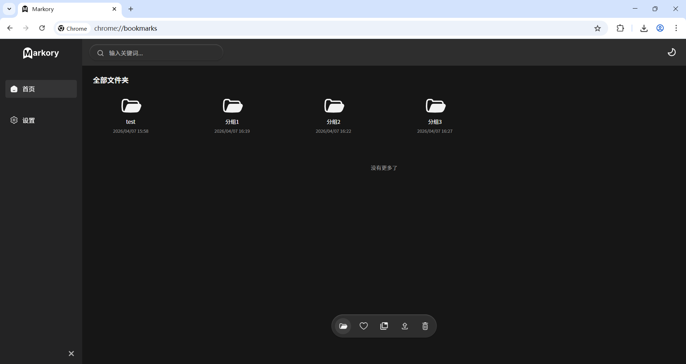
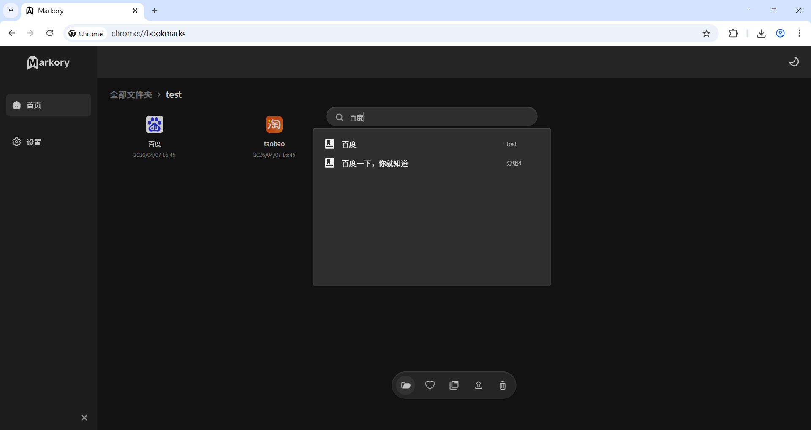
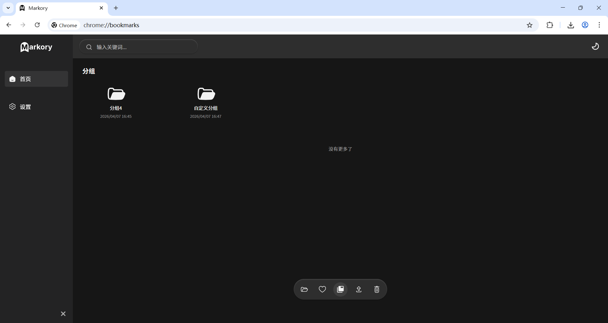
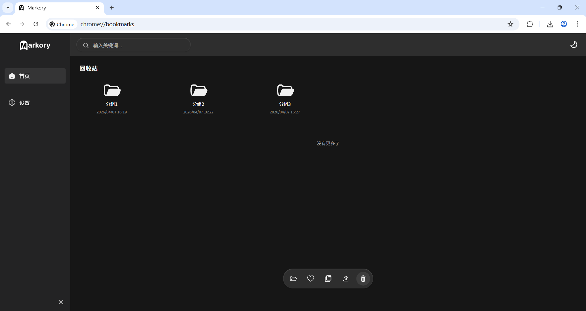
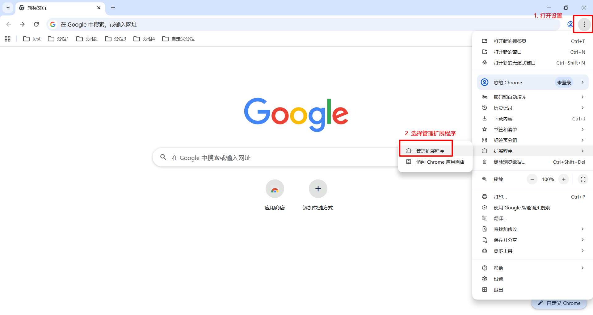
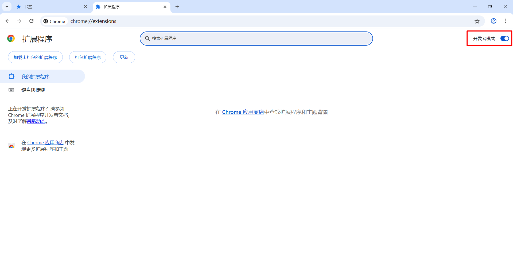
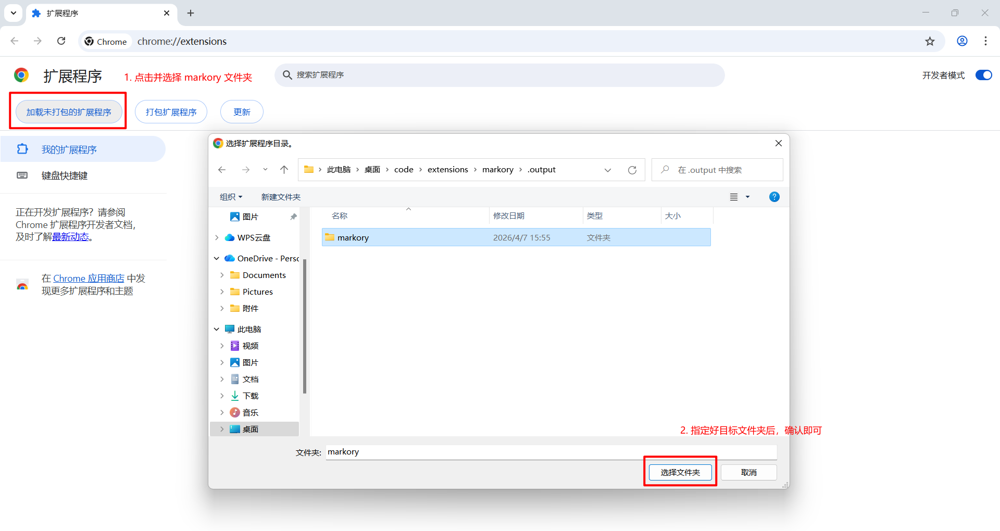
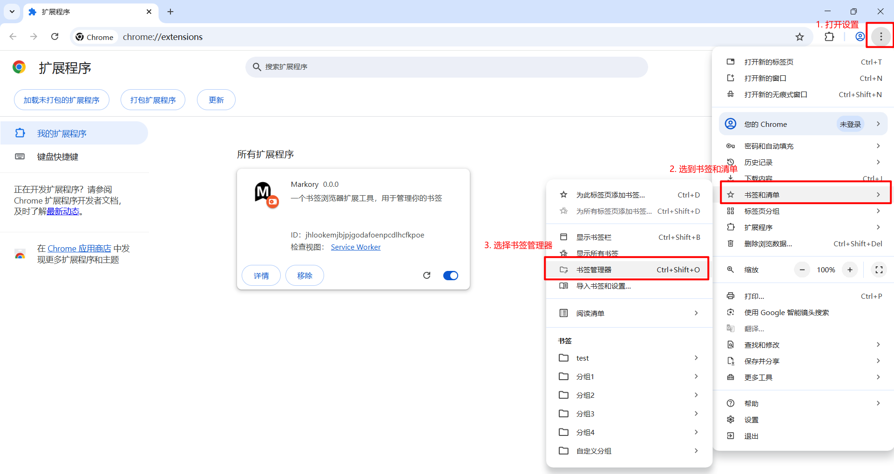

# Markory

<p align="center">
  
</p>

<p align="center">
  一个更适合整理、归档、回看的浏览器书签工作台
</p>

<p align="center">
  
  
  
  
  
</p>

Markory 是一个基于 `WXT + Vue 3 + TypeScript` 开发的浏览器书签扩展。它不只是替换原生书签页的样式，而是围绕“整理、沉淀、恢复、迁移”这几类高频动作，重新组织了一套更轻量、更直观的书签管理工作流。

目前项目已经具备日常可用的书签浏览、全局搜索、关注沉淀、窗口标签页分组归档、导入导出、回收站恢复、实时同步和个性化设置能力。

## 功能亮点

- 全局搜索整个书签树，并显示命中结果所在目录
- 独立的 `Focus` 视图，用来沉淀高频书签和常用文件夹
- 支持把当前窗口全部标签页一键保存为书签分组
- 支持把分组中的链接重新批量打开并自动整理成浏览器标签组
- 提供 `Import` 视图，集中查看本次导入生成的节点
- 提供回收站机制，删除后可恢复，默认保留 10 天并自动清理过期项
- 支持右键菜单、拖拽移动、树形目录移动等高频整理操作
- 支持书签悬浮预览、favicon 回退、深浅色主题切换和中英文切换
- 支持导入导出书签数据，并同步保留 Focus、Group、Import、Recycle 等状态
- 支持监听浏览器原生书签的新增、编辑、删除、移动并实时刷新界面

## 效果预览

### 首页总览

展示左侧导航、面包屑、搜索入口、书签卡片区和底部功能岛。



### 全局搜索与定位

搜索结果会展示书签所属目录，并支持直接跳转定位或打开链接。



### 标签页分组归档

支持把当前窗口标签页沉淀为书签分组，并在 `Group` 视图中统一管理。



### 回收站与恢复

删除的节点可先进入回收站，再进行恢复、清空或等待自动过期清理。



## 核心功能

### 1. 书签主页与目录浏览

- 提供独立的书签管理主页
- 支持从顶层目录逐级进入子文件夹
- 使用面包屑展示当前路径并支持快速回退
- 使用网格卡片展示书签与文件夹
- 对大量节点做了增量渲染，长列表浏览更轻盈

### 2. 全局书签搜索

- 顶部提供全局搜索入口
- 搜索范围覆盖整个书签树，而不只限当前目录
- 搜索结果展示所属父级目录
- 点击结果可自动跳转到对应位置
- 命中链接时也可以直接新开标签页访问

### 3. 书签与文件夹管理

- 新建文件夹
- 新建书签
- 编辑书签或文件夹
- 删除书签或文件夹
- 创建或编辑书签时会自动补全缺失的 URL 协议头

### 4. 右键菜单工作流

主页空白区域和节点都支持右键操作，可直接触发：

- 新建文件夹 / 新建书签
- 打开书签
- 编辑节点
- 移动节点
- 放入回收站
- 从回收站恢复
- 永久删除
- 清空回收站
- 将当前窗口标签页保存为新的书签分组
- 打开某个书签分组中的全部链接

### 5. Focus 关注列表

- 支持给书签或文件夹添加“关注”标记
- 在独立的 `Focus` 视图中快速查看重点内容
- 关注状态会本地持久化保存

### 6. 标签页分组沉淀为书签

- 在扩展内一键把当前窗口全部标签页保存为书签分组
- 也支持通过浏览器页面右键菜单触发
- 分组名称会自动按序号生成
- 保存后的分组可在 `Group` 视图中统一查看
- 支持把该分组内全部链接批量重新打开，并自动整理为浏览器标签组

### 7. 导入导出与数据迁移

- 设置页支持导出当前书签数据为 JSON 文件
- 导出内容不仅包含书签树，也包含 Focus、Group、Import、Recycle 状态
- 支持从 JSON 文件导入数据
- 导入采用追加模式，不会覆盖现有书签
- 即使同名同 URL，也会作为新节点创建
- 导入成功后可在 `Import` 视图中集中查看本次导入生成的节点

### 8. 回收站机制

- 删除节点时可先放入回收站
- 回收站中的节点支持恢复
- 支持手动永久删除
- 支持一键清空回收站
- 回收站默认保留 10 天，过期节点会自动清理

### 9. 拖拽移动与树形移动

- 支持把书签或文件夹拖拽到目标文件夹中
- Focus、Group、Import、Recycle 这些特殊视图下会禁用不合适的拖拽操作
- 非文件夹节点不会被误识别为拖放目标
- 支持通过“移动”弹窗在树形目录中精确选择位置

### 10. 图标与页面预览

- 优先尝试加载站点 favicon
- favicon 加载失败时自动回退到占位图标
- 对系统页面链接做了兼容处理
- 可选开启书签悬浮截图预览

### 11. 实时同步浏览器书签变更

- 监听浏览器书签的创建、编辑、删除、移动事件
- 外部发生变更时，扩展界面会自动同步刷新
- 会同步维护 Focus、Group、Import 和 Recycle 等本地状态的有效性
- 浏览器右键菜单中创建的分组也会自动汇入扩展视图

### 12. 个性化设置

- 中英文界面切换
- 深色 / 浅色主题切换
- 书签悬浮预览开关
- 导入 / 导出操作入口
- 一键清理 Focus、Group、Import、Recycle 等缓存状态
- 左侧导航栏折叠收起

## 信息架构

一级页面：

- `Home`
- `Settings`

`Home` 内包含五个核心视图：

- `All Folders`
- `Focus`
- `Group`
- `Import`
- `Recycle Bin`

`Settings` 当前提供：

- 语言切换
- 悬浮预览开关
- 导入 / 导出
- 缓存清理

## 典型使用方式

### 整理已有书签

- 进入 `All Folders`
- 通过搜索、右键菜单、拖拽移动快速调整结构
- 误删时先进入 `Recycle Bin` 恢复

### 保存当前任务上下文

- 打开一批调研页面或工作页面
- 在扩展内或页面右键菜单触发“分组当前窗口标签页”
- 在 `Group` 视图中统一回看
- 需要继续时一键重新打开整组链接

### 沉淀个人常用入口

- 把高频使用的书签或文件夹标记为 `Focus`
- 后续直接在 `Focus` 视图中访问

### 在浏览器之间迁移数据

- 在旧环境导出 Markory 数据文件
- 在新环境导入 JSON 文件
- 到 `Import` 视图检查本次导入节点
- 继续按需整理导入内容到正式目录

## 安装与启动

### 本地开发

```bash
pnpm install
pnpm dev
```

运行后可在 Chromium 系浏览器中加载开发产物目录：

```bash
.output/markory-dev
```

### 本地构建

```bash
pnpm build
```

构建完成后可加载：

```bash
.output/markory
```

### Firefox

```bash
pnpm dev:firefox
pnpm build:firefox
```

### 打包

```bash
pnpm zip
pnpm zip:firefox
```

### 类型检查

```bash
pnpm compile
```

## 在浏览器中加载扩展

### Chrome / Edge

1. 打开扩展管理页



2. 开启“开发者模式”



3. 选择“加载已解压的扩展程序”，指向 `markory-dev` 或 `markory`



4. 打开书签页



### Firefox

1. 运行 `pnpm dev:firefox` 或 `pnpm build:firefox`
2. 打开 Firefox 的调试扩展页面
3. 加载对应构建产物

## 发布前检查建议

- 检查扩展名称、描述、图标和权限说明是否准确
- 检查 README 中的截图、安装说明和功能描述是否与当前版本一致
- 检查导入导出文件是否能跨浏览器版本正常读写
- 检查回收站保留天数、右键菜单文案、多语言文案是否符合预期
- 检查悬浮预览在网络不可用场景下是否有合理表现

## 项目结构

```text
markory/
├─ assets/                 静态资源与图标
├─ components/             通用组件
├─ docs/                   README 与发布相关素材
├─ entrypoints/
│  ├─ background.ts        扩展后台入口
│  ├─ content.ts           内容脚本入口
│  └─ bookmarks/           书签管理主应用
├─ i18n/                   国际化逻辑
├─ locales/                扩展文案语言包
├─ public/                 公共静态文件
├─ utils/                  工具函数
├─ wxt.config.ts           WXT 配置
└─ package.json            项目脚本与依赖
```

## 技术栈

- `WXT`
- `Vue 3`
- `TypeScript`
- `Pinia`
- `Vue Router`
- `Vue I18n`
- `VueUse`
- `idb-keyval`
- `animate.css`

## 浏览器权限说明

当前扩展使用了以下核心权限：

- `bookmarks`：读取和管理书签树
- `tabs`：读取当前窗口标签页、打开书签链接
- `tabGroups`：将批量打开的标签整理为标签组
- `storage`：持久化本地设置、关注列表、分组状态、导入状态等数据
- `contextMenus`：注册浏览器右键菜单

## 数据与限制说明

- 书签悬浮预览依赖外部截图服务生成缩略图，因此该功能需要网络可用
- 导入操作为追加模式，不会覆盖现有书签，也不会主动去重
- 回收站节点会在超过 10 天后自动清理
- 清理缓存会移除 Focus、Group、Import、Recycle 等本地状态，但不会删除真实书签数据
- 当前 README 以仓库中已经实现的能力为准，不包含尚未落地的规划功能

## Contributing

欢迎继续迭代 Markory。

相关协作文档：

- `CONTRIBUTING.md`
- `CHANGELOG.md`
- `LICENSE`

基础协作流程：

```bash
pnpm install
pnpm dev
pnpm compile
```

提交改动前，建议至少确认：

- 首页、设置页可以正常打开
- 中英文切换正常
- 深浅色主题切换正常
- 搜索、分组、导入导出、回收站等核心流程没有明显回归

## License

This project is licensed under the `MIT` License.
