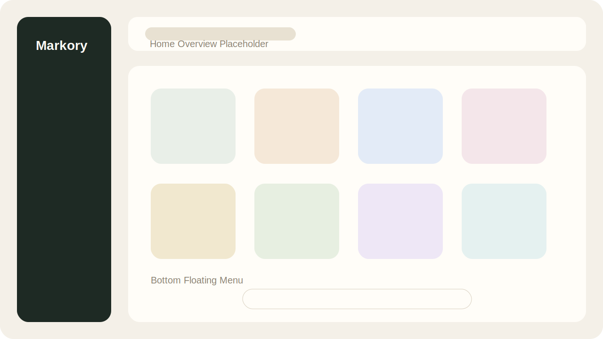
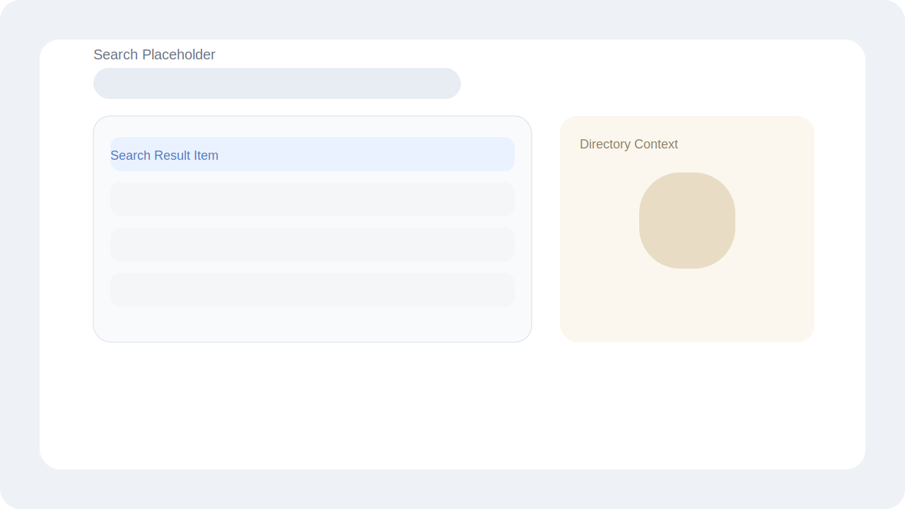
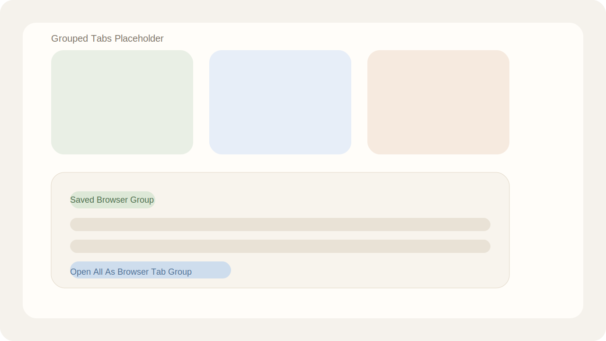
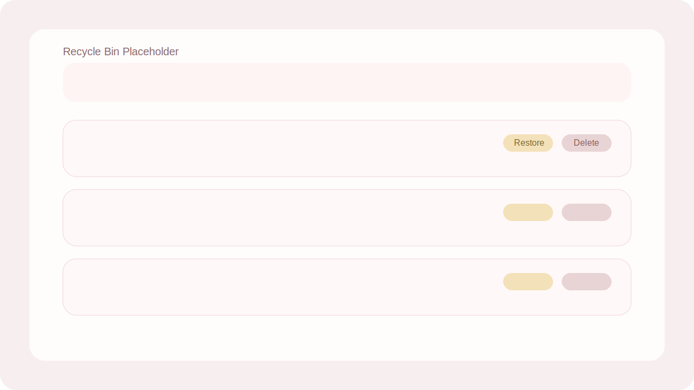

# Markory

<p align="center">
  
</p>

<p align="center">
  一个更适合整理、归档与回看的浏览器书签工作台
</p>

<p align="center">
  
  
  
  
  
</p>

Markory 是一个基于 `WXT + Vue 3 + TypeScript` 开发的浏览器书签扩展。它不是简单地把原生书签页换个皮肤，而是围绕“整理行为”重新设计了一套更轻量、更直观、更适合高频使用的书签管理体验。

目前项目主体功能已经基本完成，已经具备日常可用的书签浏览、搜索、整理、分组、回收和个性化设置能力。

## 功能亮点

- 全局搜索整个书签树，并显示命中结果所在目录
- 独立的 `Focus` 视图，用来沉淀高频书签
- 支持把当前窗口全部标签页快速保存为书签分组
- 支持把书签分组重新批量打开并自动归为浏览器标签组
- 提供回收站机制，删除后可恢复，默认保留 10 天
- 支持右键菜单、拖拽移动、树形选择移动等高频整理操作
- 支持 favicon 回退、书签悬浮截图预览、深浅色主题切换
- 支持中英文切换，并能同步监听浏览器原生书签变更

## 效果预览

目前仓库里还没有正式的产品截图，但 README 已经预留好了展示位。后续你可以直接把截图放到例如 `docs/`、`assets/` 或仓库图床中，然后替换下面这些位置：

### 首页总览

建议展示内容：

- 左侧导航
- 顶部搜索
- 中间网格书签视图
- 底部悬浮菜单

```md

```

### 搜索与定位

建议展示内容：

- 搜索结果弹层
- 命中书签所在目录
- 点击后跳转定位效果

```md

```

### 标签页分组归档

建议展示内容：

- 当前窗口标签页快速归档
- Group 视图中的分组卡片
- 一键重新打开为浏览器标签组

```md

```

### 回收站与恢复

建议展示内容：

- 放入回收站
- 回收站中的节点列表
- 恢复与彻底删除操作

```md

```

## 项目定位

Markory 适合下面这类场景：

- 浏览器书签越积越多，原生书签管理页不够顺手
- 想快速找到某个书签，或快速定位它所在的文件夹
- 想把常用书签单独维护成一个轻量的重点列表
- 想把一次调研、一轮阅读、一个任务窗口快速归档成书签组
- 想在整理书签时保留恢复余地，而不是直接永久删除

## 核心功能

### 1. 书签主页与目录浏览

- 提供独立的书签管理主页
- 支持从顶层文件夹逐级进入子文件夹
- 使用面包屑展示当前路径
- 使用网格卡片展示书签与文件夹
- 对大量节点做了增量渲染，滚动浏览更轻盈

### 2. 全局书签搜索

- 顶部提供全局搜索入口
- 搜索范围覆盖整个书签树，而非仅当前目录
- 搜索结果会显示所属父级目录
- 点击结果可自动跳转到对应目录
- 若结果是链接，也可直接打开页面

### 3. 书签与文件夹管理

- 新建文件夹
- 新建书签
- 编辑书签或文件夹
- 删除书签或文件夹
- 创建或编辑书签时自动补全缺失的 URL 协议头

### 4. 右键菜单工作流

主页空白区域和节点都支持右键操作，可直接触发：

- 新建文件夹 / 新建书签
- 打开书签
- 编辑节点
- 移动节点
- 放入回收站
- 从回收站恢复
- 永久删除
- 清空回收站
- 将当前窗口标签页保存为新的书签分组
- 打开某个书签分组内的全部链接

### 5. Focus 关注列表

- 支持给书签或文件夹添加“关注”标记
- 在独立的 `Focus` 视图中快速查看重点内容
- 关注状态会本地持久化保存

### 6. 标签页分组沉淀为书签

- 在扩展内一键把当前窗口全部标签页保存为书签分组
- 也支持通过浏览器页面右键菜单触发
- 分组名称会自动按序号生成
- 保存后的分组可在 `Group` 视图中统一查看
- 支持把该分组内全部链接批量重新打开，并自动整理为浏览器标签组

### 7. 回收站机制

- 删除节点时可先放入回收站
- 回收站中的节点支持恢复
- 支持手动永久删除
- 支持一键清空回收站
- 回收站默认保留 10 天，过期自动清理

### 8. 拖拽移动与树形移动

- 支持把书签或文件夹拖拽到目标文件夹中
- 非文件夹节点不会被误识别为拖放目标
- 支持通过“移动”弹窗在树形目录中精确选择位置

### 9. 图标与页面预览

- 优先尝试加载站点 favicon
- favicon 加载失败时自动回退到默认占位图标
- 对系统页面链接做了图标兼容
- 可选开启书签悬浮截图预览

### 10. 实时同步浏览器书签变更

- 监听浏览器书签的创建、编辑、删除、移动事件
- 外部发生变更时，扩展界面会同步刷新
- 会同步维护关注列表、回收站和分组状态的有效性

### 11. 个性化设置

- 中英文界面切换
- 深色 / 浅色主题切换
- 书签悬浮预览开关
- 左侧导航栏折叠收起

## 当前信息架构

一级页面：

- `Home`
- `Settings`

`Home` 内部包含四个核心视图：

- `All Folders`
- `Focus`
- `Group`
- `Recycle Bin`

## 安装与启动

### 本地开发

```bash
pnpm install
pnpm dev
```

运行后可在 Chromium 系浏览器中加载开发产物目录：

```bash
.output/markory-dev
```

### 本地构建

```bash
pnpm build
```

构建完成后可加载：

```bash
.output/markory
```

### Firefox

```bash
pnpm dev:firefox
pnpm build:firefox
```

### 打包

```bash
pnpm zip
pnpm zip:firefox
```

### 类型检查

```bash
pnpm compile
```

## 在浏览器中加载扩展

### Chrome / Edge

1. 打开扩展管理页
2. 开启“开发者模式”
3. 选择“加载已解压的扩展程序”
4. 指向 `.output/markory-dev` 或 `.output/markory`

### Firefox

1. 运行 `pnpm dev:firefox` 或 `pnpm build:firefox`
2. 打开 Firefox 的调试扩展页面
3. 加载对应构建产物

## 发布建议

如果你准备把 Markory 对外发布，这里是一套比较顺手的流程：

### 1. 开发阶段

- 使用 `pnpm dev` 或 `pnpm dev:firefox` 进行本地迭代
- 在真实书签数据环境下验证搜索、拖拽、回收站和分组能力
- 对中英文、深浅色和预览开关分别做一轮手测

### 2. 构建阶段

- 执行 `pnpm build`
- 如需 Firefox 构建，执行 `pnpm build:firefox`
- 如需分发压缩包，执行 `pnpm zip` 或 `pnpm zip:firefox`

### 3. 发布前检查

- 检查扩展名称、描述、图标和权限说明是否准确
- 检查 README 中的截图、安装说明和功能描述是否与当前版本一致
- 检查回收站保留天数、右键菜单文案、多语言文案是否符合预期
- 检查预览功能对网络不可用场景是否有合理表现

### 4. 对外展示建议

- 补充 3 到 5 张真实截图
- 增加版本号与更新日志
- 增加“已实现 / 规划中”两类功能清单
- 补充商店页描述、图标和展示素材

## 典型使用方式

### 整理已有书签

- 进入 `All Folders`
- 通过搜索、右键菜单、拖拽移动快速调整结构
- 误删时先进入 `Recycle Bin` 恢复

### 保存当前任务上下文

- 打开一批调研页面或工作页面
- 在扩展内或页面右键菜单触发“分组当前窗口标签页”
- 在 `Group` 视图中统一回看

### 沉淀个人常用入口

- 把高频使用的书签标记为 `Focus`
- 后续直接在 `Focus` 视图中访问

## 项目结构

```text
markory/
├─ assets/                 静态资源与图标
├─ components/             通用组件
├─ entrypoints/
│  ├─ background.ts        扩展后台入口
│  ├─ content.ts           内容脚本入口
│  └─ bookmarks/           书签管理主应用
├─ i18n/                   国际化逻辑
├─ locales/                扩展文案语言包
├─ public/                 公共静态文件
├─ utils/                  工具函数
├─ wxt.config.ts           WXT 配置
└─ package.json            项目脚本与依赖
```

## 技术栈

- `WXT`
- `Vue 3`
- `TypeScript`
- `Pinia`
- `Vue Router`
- `Vue I18n`
- `VueUse`
- `idb-keyval`
- `animate.css`

## 浏览器权限说明

当前扩展使用了以下核心权限：

- `bookmarks`：读取和管理书签树
- `tabs`：读取当前窗口标签页、打开书签链接
- `tabGroups`：将批量打开的标签整理为标签组
- `storage`：持久化本地设置、关注列表、分组状态等数据
- `contextMenus`：注册浏览器右键菜单

## License

This project is licensed under the `MIT` License.

## 说明与限制

- 书签悬浮预览依赖外部截图服务生成缩略图，因此该功能需要网络可用
- 当前 README 以仓库中已经实现的能力为准，不包含尚未落地的规划功能
- 如果你打算将项目对外发布，建议后续补充真实截图、版本号和更新日志

## 后续可以继续补的 README 内容

如果你还想继续把仓库包装得更完整，下一步最值得补的是：

- `CHANGELOG.md`，记录每个版本新增功能和修复内容
- 一组真实产品截图或演示 GIF
- 一个简短的“为什么做 Markory”项目故事
- 发布到 Chrome Web Store / Firefox Add-ons 后的商店链接

## 适合继续扩展的方向

- 更强的筛选与排序能力
- 书签批量操作
- 导入导出能力
- 多维度统计视图
- 快捷键支持
- 更丰富的预览和站点元信息展示

## Contributing

欢迎继续迭代 Markory。

相关协作文档：

- `CONTRIBUTING.md`
- `CHANGELOG.md`
- `LICENSE`

如果你准备参与开发，建议优先关注下面几类内容：

- 书签批量操作和更强的筛选排序
- 真实截图、演示 GIF 与商店素材
- Firefox 兼容性与跨浏览器验证
- 文案、国际化和交互细节打磨

基础协作流程：

```bash
pnpm install
pnpm dev
pnpm compile
```

提交改动前，建议至少确认：

- 主页、设置页可以正常打开
- 中英文切换正常
- 深浅色主题切换正常
- 搜索、分组、回收站等核心流程没有明显回归

## 总结

如果用一句话概括 Markory，它更像是一个面向“整理”和“归档”的书签工作台，而不只是一个书签列表查看器。

它已经具备以下特征：

- 比原生书签页更适合高频整理
- 兼顾快速操作和安全回退
- 同时覆盖“书签管理”和“标签页归档”两类需求
- 结构完整，已经具备继续产品化打磨的基础
